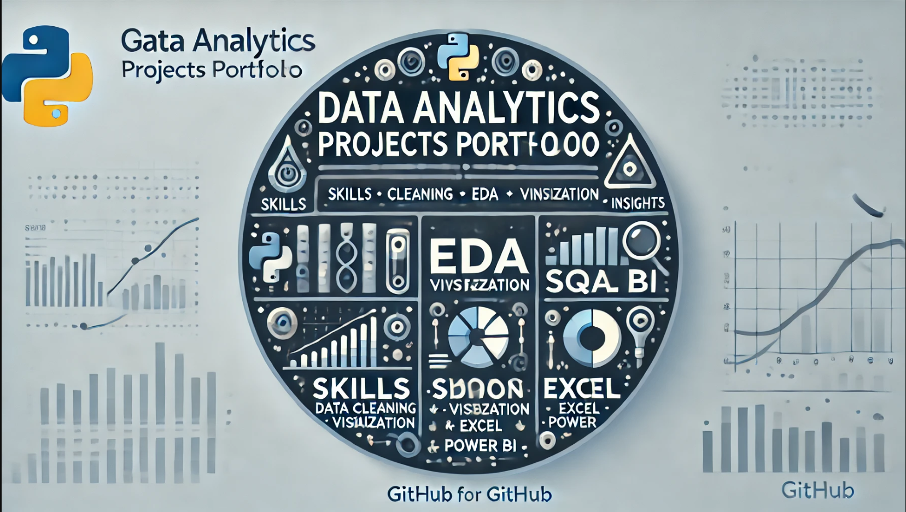

# Data Analytics Projects Portfolio



## About This Repository
This repository showcases my work in **data analytics** through a collection of projects. Each project highlights skills in data cleaning, analysis, and visualization, using tools and technologies such as **Python**, **SQL**, **Excel**, and **Power BI**.

---

## Featured Projects

### 1. Sales Analysis Dashboard
- **Description:** Interactive dashboard analyzing sales trends, customer segmentation, and profit margins.
- **Tools Used:** Excel, Power BI
- **Key Insights:** Identified top-performing regions and optimized product profitability.

### 2. Hiring Process Analytics
- **Description:** Analyzed hiring data to explore gender distribution, salary trends, and departmental insights.
- **Tools Used:** Python, Excel
- **Key Insights:** Suggested strategies for improving diversity and fair salary distribution.

### 3. Car Market Analysis
- **Description:** Regression analysis and visualization of car prices, engine power, and market categories.
- **Tools Used:** Python, Power BI
- **Key Insights:** Predicted pricing trends and identified popular market categories.

---

## Skills Demonstrated
- **Data Cleaning and Preprocessing**
- **Exploratory Data Analysis (EDA)**
- **Data Visualization** (Excel, Power BI, Python)
- **Statistical Analysis**
- **SQL Queries for Insights**

---

## How to Explore This Repository
1. **Clone this repository:**
   ```bash
   git clone https://github.com/your-username/repo-name.git
   ```
2. Navigate to individual project folders for detailed documentation and code.

---

## Connect With Me
- **LinkedIn:** ([https://www.linkedin.com/in/your-profile](https://www.linkedin.com/in/deeraj-natarajan-a3077a18b/?originalSubdomain=in))
- **GitHub:**(https://github.com/DEERAJ271))

Feel free to explore, provide feedback, or collaborate on projects!
